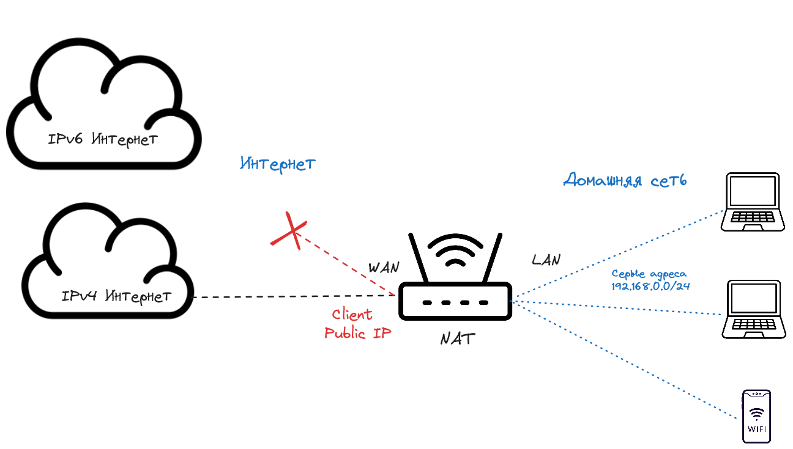
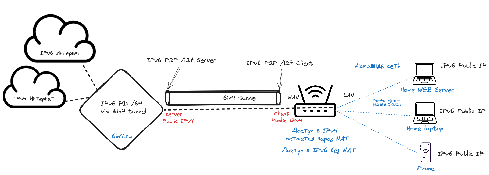

# Tunnel Broker

### Классическая схема сети на IPv4 адресах
Схема ниже показывает пример текущей домашней сети. У пользователя дома есть Wi-Fi роутер который подключается к интернет через своего провайдера. Провайдер выдает либо серый, либо белый IP. К сожалению 6in4 не будет работать с серым адрес и для использования сервиса нужен публичный (белый) IPv4 адрес на домашнем роутере. Как правило в своем личном кабинете у провайдера можно заказать услугу белый адрес или статический белый адрес.

В этой схеме нет возможности получить доступ в IPv6 интернет поскольку для этого нужны специальные IPv6 адреса. Некоторые операторы домашнего интернета и мобильные операторы уже выдают IPv4 и IPv6 адрес в dual-stack т.е. одновременно, но многие еще даже не задумываются об этом. Хотя почти все контент провайдеры уже есть в IPv6 интернете и выдача dual-stack адресов для операторов будет выгодня в сокращении количества NAT трансляций и повышения стабильности доступа в интернет.

### Схема сети на IPv4/IPv6 адресах
Теперь посмотрим на домашнюю сеть с использованием 6in4 туннеля

При использовании сервиса 6in4 между нашим сервисом и вашим белым адресом на роутере будет построен туннель 6in4 который будет упаковывать IPv6 пакеты в IPv4, поэтому туннель так и называется 6in4 -> 6в4. Так же будет прописана дополнительная сеть /64 которая будет использоваться для адресации устройств в домашней сети т.о. домашний сервер будет доступен в Интернете с настоящим белым IPv6 адресом. Затем эти пакеты по IPv4 сети дойдут до нашего сервера, сервер их распакует и отправит дальше в IPv6 интернет, обратно ответ будет упакован аналогично.

Итак:
- сеть /127 между сервером и домашним роутером это сеть Point-to-point - P2P.
- cеть /64 для адресации домашних устройств это сеть Prefix Delegation - PD.

Поскольку не все пользователи знают и умеют защищать домашнюю сеть от внешний угроз, наш сервис позволяет запретить все внешние подключения к IPv6 PD адресам по портам >1024. Если нужен это изменить, пишите в техническую поддержку в телеграм (@tunnelsupport - 6in4 Support). IPv6 умеет работать с DNS по IPv4, вернее сказать DNS умеет отвечать на ipv4/ipv6 запросы независимо от сети через которую пришел запрос, но мы все равно рекомендуем прописать IPv6 DNS адреса.

